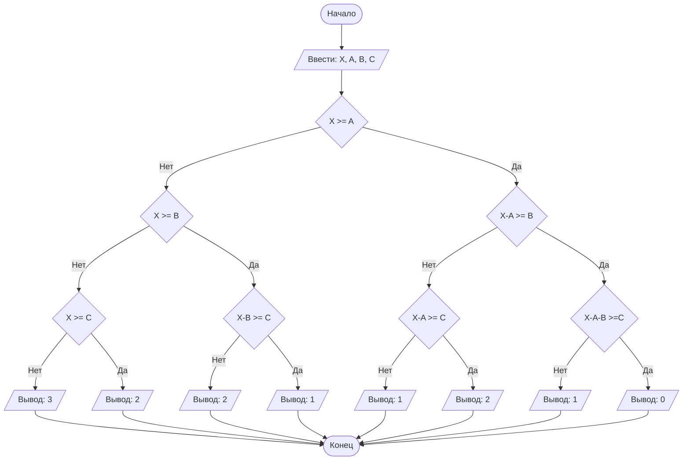

## Отчет по лабораторной работе № 1

#### № группы: `ПМ-2501`

#### Выполнила: `Глазачева Вера Андреевна`

#### Вариант: `4`

### Cодержание:

- [Постановка задачи](#1-постановка-задачи)
- [Входные и выходные данные](#2-входные-и-выходные-данные)
- [Выбор структуры данных](#3-выбор-структуры-данных)
- [Алгоритм](#4-алгоритм)
- [Программа](#5-программа)
- [Анализ правильности решения](#6-анализ-правильности-решения)

### 1. Постановка задачи

#### Условия задачи

> Трое жильцов решили выбросить в контейнер объемом Х литров мусорные пакеты объемом А, В, С литров соответственно. Они подходят к контейнеру в указанном порядке и пытаются поместить пакет в контейнер. Если пакет не помещается в контейнер, жилец уносит свой пакет в другое место. Скольким жильцам не удастся выкинуть мусор в указанный контейнер? На вход программы подаются натуральные числа Х, А, В, С.

- Данную задачу можно свести к задаче о поиске количества невлезших мусорных пакетах в контейнер, последовательно выясняя влезает пакет или нет, если пакет поместился в кантейнер, то объем кантейнера уменьшается на объем этого пакета, далее проверяем влезит ли следующий пакет в кантейнер и так для трех пакетов последовательно, а ответом на вопрос будет количество невлезших пакетов в кантейнер, то есть количество людей, которые не смогли выкинуть мусор в данный контейнер.

### 2. Входные и выходные данные

#### Входные данные
На вход программа получает 4 натуральных числа.

#### Выходные данные
Так как программа считает количество жильцов, то на выход мы получим целое число от 0 до 3, так как жителей всего трое.

### 3. Выбор структуры данных

На вход программа получает 4 натуральных числа, поэтому для их хранения можно создать 4 переменные ('X', 'A', 'B', 'C') типа 'int'.

|                           | название переменной | Тип (в Java) | 
|---------------------------|---------------------|--------------|
| X (общий объем контейнера)|         `X`         |    `int`     |
| A (объем пакета 1 жильца) |         `A`         |    `int`     | 
| B (объем пакета 2 жильца) |         `B`         |    `int`     |
| C (объем пакета 3 жильца) |         `C`         |    `int`     | 

### 4. Алгоритм

#### Алгоритм выполнения программы:

1. **Ввод данных:**
   Программа считывает четыре целых числа, обозначенные как 'X', 'A', 'B' и 'C'.
   
3. **Поиск колическва невлезших пакетов**
   Выясняем ответна вопрос: "Влезает ли пакет в кантейнер на данный момент или нет?", если ответ на вопрос да, то объем контейнера уменьшается на объем проверяемого пакета, если нет остается прежном, после последовательных ответов на вопросы про первый, второй и третий пакеты, выяснить количество ответов нет, оно и будет ответом на задачу.
   
4. **Вывод результата**
   Программа выводит количество невлезших пакетов в кантейнер, то есть количество жильцов, которым не удалось выбросить мусор в указанный контейнер.
   
#### Блок-схема:



### 5. Программа

```java
import java.io.PrintStream;
import java.util.Scanner;

public class Main {
    // Объявляем объект класса PrintStream для вывода данных
    public static PrintStream out = System.out;
    // Объявляем объект класса Scanner для ввода данных
    public static Scanner in = new Scanner(System.in);

    public static void main(String[] args) {
        // Считывание четырех целых чисел
        int X = in.nextInt();
        int A = in.nextInt();
        int B = in.nextInt();
        int C = in.nextInt();

        // Вмещается ли первый пакет в контейнер
        if (X >= A)
            // Вмещается ли второй пакет в контейнер при лежащем в нем первом пакете
            if (X-A >= B)
                // Вмещается ли третий пакет в контейнер при лежащих в нем первом и втором пакетах
                if (X-A-B >= C)
                    out.print(0);
                else
                    out.print(1);
            else
                // Вмещается ли третий пакет в контейнер при лежащем в нем первом пакете
                if (X-A >= C)
                    out.print(1);
                else
                    out.print(2);
        else
            // Вмещается ли второй пакет в контейнер
            if (X >= B)
                // Вмещается ли третий пакет в контейнер при лежащем в нем втором пакете
                if (X-B >= C)
                    out.print(1);
                else
                    out.print(2);
            else
                // Вмещается ли третий пакет в контейнер
                if (X >= C)
                    out.print(2);
                else
                    out.print(3);
    }
}
```

### 6. Анализ правильности решения

1. Тест на вместимость всех пакетов:

 Input:
    ```
    1000
    50
    30
    20
    ```

 Output:
    ```
    0
    ```

2. Тест на вместимость только первого и второго пакетов:

 Input:
    ```
    100
    50
    30
    30
    ```

 Output:
    ```
    1
    ```

3. Тест на вместимость только первого и третьего пакетов:

 Input:
    ```
    50
    30
    30
    10
    ```

 Output:
    ```
    1
    ```

 4. Тест на вместимость только второго и третьего пакетов:

 Input:
    ```
    50
    60
    30
    10
    ```

 Output:
    ```
    1
    ```

5. Тест на вместимость толлько первого пакета:

 Input:
    ```
    50
    50
    30
    10
    ```

 Output:
    ```
    2
    ```

 6. Тест на вместимость толлько второго пакета:

 Input:
    ```
    50
    60
    40
    20
    ```

 Output:
    ```
    2
    ```

7. Тест на вместимость толлько третьего пакета:

 Input:
    ```
    50
    60
    60
    20
    ```

 Output:
    ```
    2
    ```

8. Тест на вместимость ни одного пакета:

 Input:
    ```
    50
    60
    60
    60
    ```

 Output:
    ```
    3
    ```   
