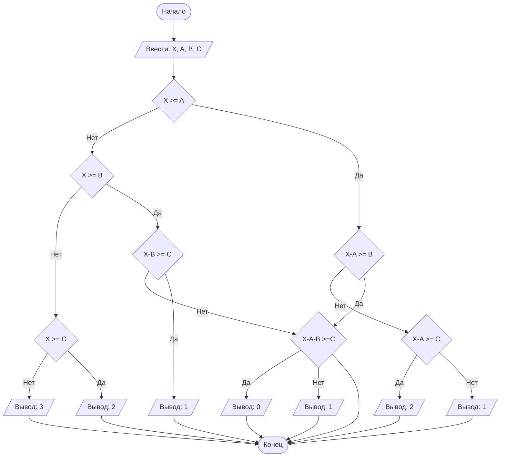

## Отчет по лабораторной работе № 1

#### № группы: `ПМ-2501`

#### Выполнила: `Глазачева Вера Андреевна`

#### Вариант: `4`

### Cодержание:

- [Постановка задачи](#1-постановка-задачи)
- [Входные и выходные данные](#2-входные-и-выходные-данные)
- [Выбор структуры данных](#3-выбор-структуры-данных)
- [Алгоритм](#4-алгоритм)
- [Программа](#5-программа)
- [Анализ правильности решения](#6-анализ-правильности-решения)

### 1. Постановка задачи

#### Условия задачи

> Трое жильцов решили выбросить в контейнер объемом Х литров мусорные пакеты объемом А, В, С литров соответственно. Они подходят к контейнеру в указанном порядке и пытаются поместить пакет в контейнер. Если пакет не помещается в контейнер, жилец уносит свой пакет в другое место.
Скольким жильцам не удастся выкинуть мусор в указанный контейнер? На вход программы подаются натуральные числа Х, А, В, С.

- 

### 2. Входные и выходные данные

#### Входные данные
На вход программа получает 4 натуральных числа.
#### Выходные данные
Так как программа считает количество жильцов, то на выход мы получим целое число от 0 до 3, так как жителей всего трое.

### 3. Выбор структуры данных

На вход программа получает 4 натуральных числа, поэтому для их хранения можно создать 4 переменные ('X', 'A', 'B', 'C') типа 'int'.

|                    | название переменной | Тип (в Java) | 
|--------------------|---------------------|--------------|
| X (общий объем)    |         `X`         |    `int`     |
| A (объем 1 жильца) |         `A`         |    `int`     | 
| B (объем 2 жильца) |         `B`         |    `int`     |
| C (объем 3 жильца) |         `C`         |    `int`     | 
### 4. Алгоритм

#### Алгоритм выполнения программы:

#### Блок-схема:



`Mermaid` нативно интегрирован в `GitHub`, а для работы в Вашей среде разработке - нужно установить
плагин: `File` > `Settings` > `Plugins`.

### 5. Программа

Полный текст программы с комментариями на русском языке

Нужно вставить код прямо в отчет в блок:

```markdown
    ```java
        class Main{
            // Что-то далее
        }
    ``` 
```

Это будет выглядеть следующим образом:

```java
class Main{
    // Что-то далее
}
```

### 6. Анализ правильности решения

Привести тесты и анализ работы программы для этих тестов.
Очень неплохо было бы обосновать выбор тестов.

1. Тест на что-то

- Input:
    ```
    1
    1
    ```

- Output:
    ```
    2
    ```

2. Тест на что-то еще

- Input:
    ```
    1
    -1
    ```

- Output:
    ```
    0
    ```
